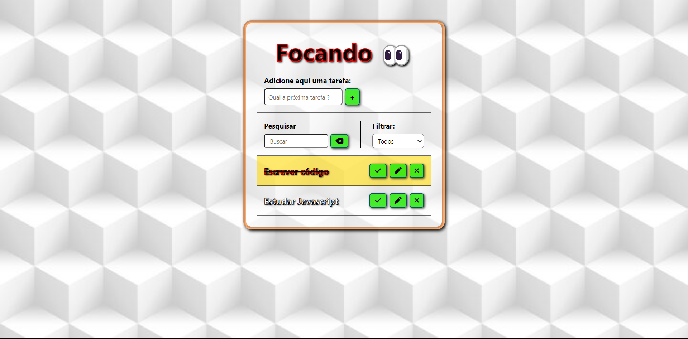

# Focando - Lista de Tarefas

Deploy: (Em Breve)

## Sobre

É uma lista de tarefas com o nome Focando. Mais uma ferramenta para auxiliar na organização da execução do trabalho, estudos ou tarefas do dia-a-dia.

### Objetivo

Ampliar meus conhecimentos de Javascript, explorando a lógica da criação de eventos.

### Desafio

Mais uma vez me desafio em ampliar minhas habilidades de JS, a cada projeto que utilizo esta linhguagem consigo compreender melhor como ela funciona, estou animado para continuar focando em ferramentas que fazem bastante uso do Javascript.

### Conclusão

Foi um desafio e tanto, achei um pouco difícil entender a lógica, porém fiquei feliz com o resultado. Irei continuar a praticar mais em projetos futuros e cada vez mais complexos.

### Ferramentas Utilizadas

- HTML
- CSS
- JavaScript